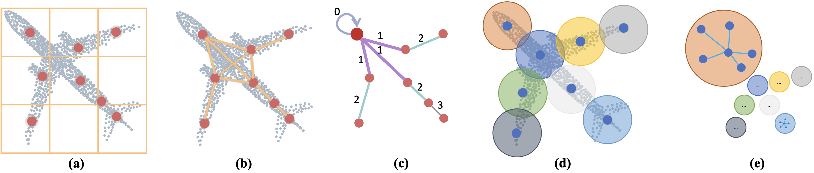
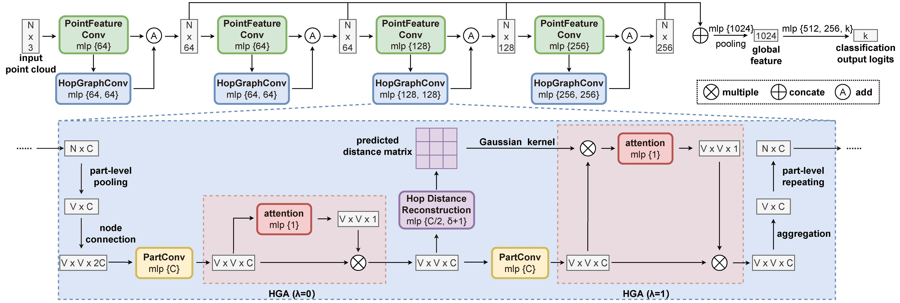
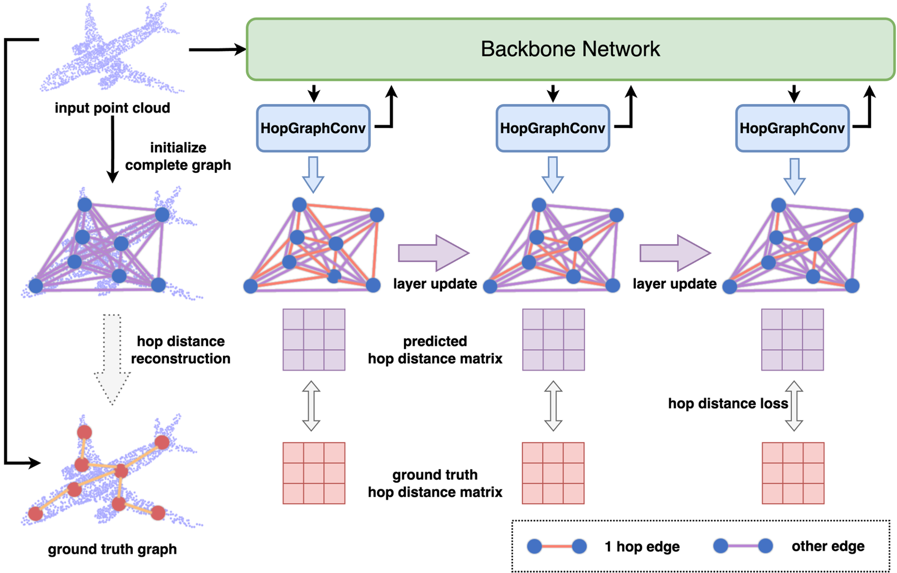
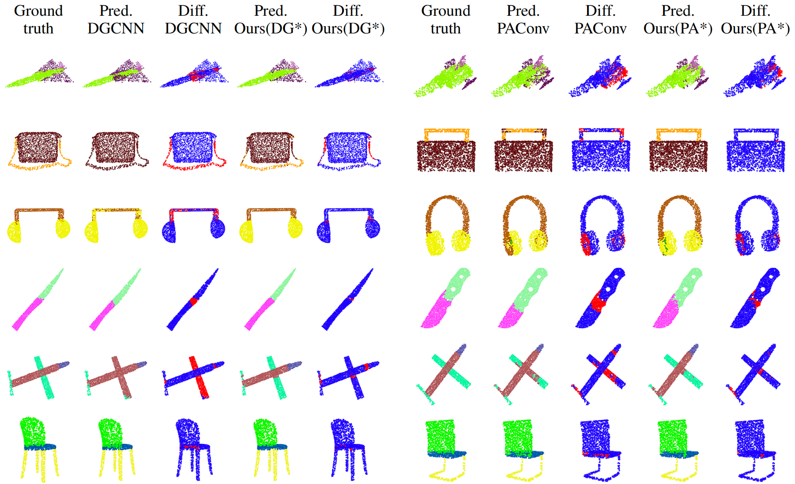
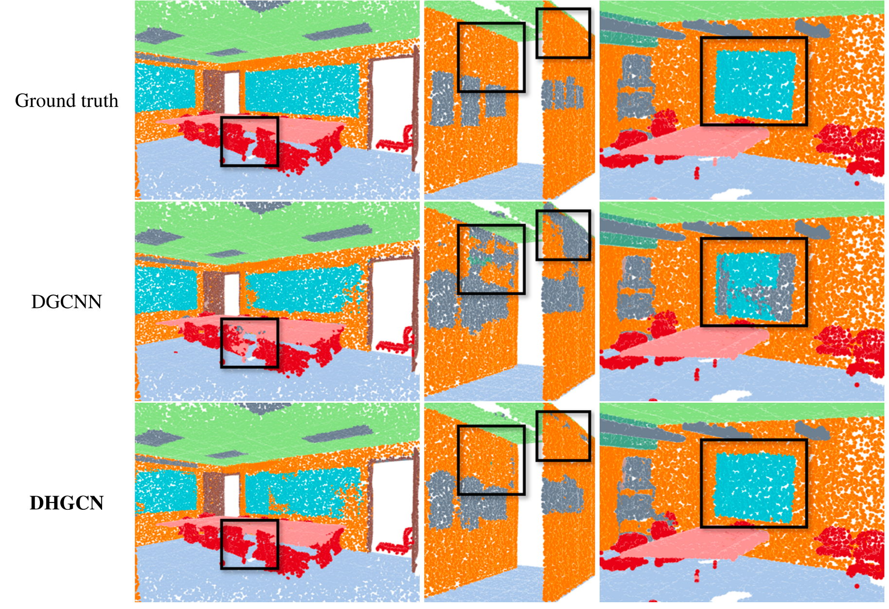

# DHGCN: Dynamic Hop Graph Convolution Network for Point Cloud Learning (AAAI 2024)

[Jincen Jiang](https://www.jincenjiang.com), Lizhi Zhao, [Xuequan Lu](http://xuequanlu.com/), [Wei Hu](https://www.wict.pku.edu.cn/huwei/), [Imran Razzak](https://imranrazzak.github.io/), and [Meili Wang](https://cie.nwsuaf.edu.cn/szdw/js/2012110003/index.htm).

[[paper](https://arxiv.org/pdf/2401.02610.pdf)]  [[poster](./figure/DHGCN-AAAI2024.pdf)]

This is the source code for the implementation of our **DHGCN** for point cloud learning.

## Introduction
### Abstract
>Recent works attempt to extend Graph Convolution Networks (GCNs) to point clouds for classification and segmentation tasks. These works tend to sample and group points to create smaller point sets locally and mainly focus on extracting local features through GCNs, while ignoring the relationship between point sets. In this paper, we propose the Dynamic Hop Graph Convolution Network (DHGCN) for explicitly learning the contextual relationships between the voxelized point parts, which are treated as graph nodes. Motivated by the intuition that the contextual information between point parts lies in the pairwise adjacent relationship, which can be depicted by the hop distance of the graph quantitatively, we devise a novel self-supervised part-level hop distance reconstruction task and design a novel loss function accordingly to facilitate training. In addition, we propose the Hop Graph Attention (HGA), which takes the learned hop distance as input for producing attention weights to allow edge features to contribute distinctively in aggregation. Eventually, the proposed DHGCN is a plug-and-play module that is compatible with point-based backbone networks. Comprehensive experiments on different backbones and tasks demonstrate that our self-supervised method achieves state of-the-art performance.

#### Highlight

>Ours: Constructing the ground truth graph for our self-supervised hop distance reconstruction task. (a): Voxelizing the point cloud into parts, taking each part as a graph node. (b): The topology of the ground truth graph. Two nodes are adjacent if their scaled bounding boxes are intersected. (c): The shortest path between a node (enlarged red point) and other nodes. The number on each node denotes the hop distance which motivates our self-supervised task.

>Others: Sampling and grouping based strategy. (d): Sampling center points and grouping local point sets. (e): Constructing a local graph for each point set. We explore the contextual relationships between parts, while previous strategies focus on extracting local features of point sets.

#### Network


#### Dynamic Update



## Requirements

* CUDA = 11.3
* Python = 3.10
* PyTorch = 1.12.1
* Numpy = 1.23.1
* Package: h5py, sklearn, plyfile, json, cv2, yaml, tqdm

Different backbone networks for different tasks may have different requirements.

## Contents

We provide source codes for different point cloud learning tasks:

* [3D Object Classification](./obj_cls) on ModelNet40 and ScanObjectNN:
  - Multi-task learning with different backbones (DGCNN, AdaptConv and PRA-Net) on ModelNet40.
  - Multi-task learning with DGCNN as the backbone on ScanObjectNN.
  - Unsupervised evaluation with linear classifier on ModelNet40. 

* [Shape Part Segmentation](./part_seg) on ShapeNet Part:
  - Multi-task learning with different backbones (DGCNN and PAConv).
  - Unsupervised evaluation with PAConv as the backbone. 

* [Scene Segmentation](./scene_seg) on S3DIS.

Please refer to the directory of each task for the usage details of our code.

## Results

#####  3D Object Classification
* Multi-task Learning on ModelNet40

| Methods |  Accuracy |
| :---: |:---: |
| PRA-Net | 93.2 |
| DHGCN (PRA-Net) | 93.4 (+0.2) |
| DGCNN | 92.9 |
| DHGCN (DGCNN) | 93.5 (+0.6) |
| AdaptConv | 93.5 |
| DHGCN (AdaptConv) | 93.6 (+0.2) |

* Multi-task Learning on ScanObjectNN

| Methods | OBJ_ONLY | OBJ_BG | PB_T50_RS|
| :---: |:---: |:---: |:---: |
| DGCNN | 86.2 | 82.8 | 78.2|
| DHGCN (DGCNN) | 88.3 (+2.1) | 88.3 (+5.5) | 82.9 (+4.8) |

* Unsupervised Representation Learning on ModelNet40

| Methods |  Pretrained dataset | Accuracy |
| :---: | :---: | :---: |
| DHGCN (DGCNN) | ShapeNet | 93.2 |
| DHGCN (AdaptConv) | ShapeNet | 93.2 |
| DHGCN (DGCNN) | ModelNet40 | 93.0 |
| DHGCN (AdaptConv) | ModelNet40 |93.3|

#####  Shape Part Segmentation

* Multi-task Learning

| Methods | Class mIoU | Instance mIoU |
| :---: | :---: | :---: |
| DGCNN | 82.3 | 85.2 |
| DHGCN (DGCNN) | 82.8 (+0.5) | 85.5 (+0.3) |
| PAConv | 84.2 | 86.0 |
| DHGCN (PAConv) | 84.5 (+0.3) |86.1 (+0.1)|

* Unsupervised Representation Learning

| Methods | Class mIoU | Instance mIoU |
| :---: | :---: | :---: |
| DHGCN (PAConv) | 82.9 | 84.9 |

* Visual Result (example)


#####  Scene Segmentation
| Methods | Accuracy | Instance mIoU |
| :---: | :---: | :---: |
| DGCNN | 84.1 | 56.1 |
| DHGCN (DGCNN) | 86.4 (+2.3) | 61.7 (+5.6) |

* Visual Result (example)


## Citation

If you find our work useful, please consider citing:

```
@article{jiang2024dhgcn,
  title={DHGCN: Dynamic Hop Graph Convolution Network for Self-Supervised Point Cloud Learning},
  author={Jiang, Jincen and Zhao, Lizhi and Lu, Xuequan and Hu, Wei and Razzak, Imran and Wang, Meili},
  journal={arXiv preprint arXiv:2401.02610},
  year={2024}
}
```
